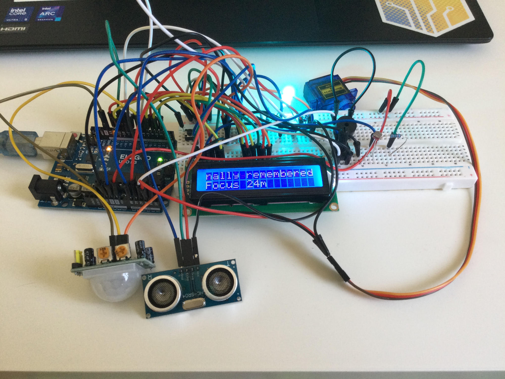
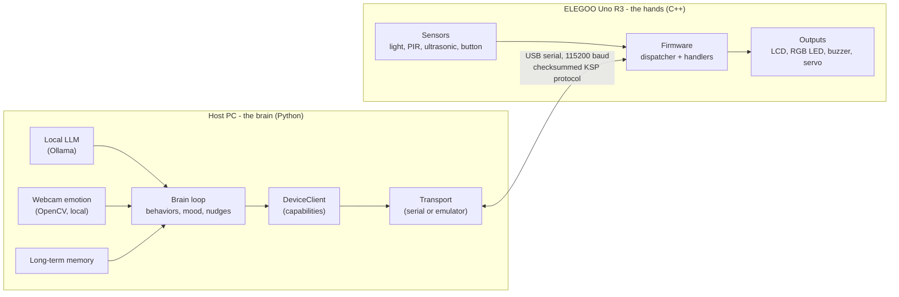
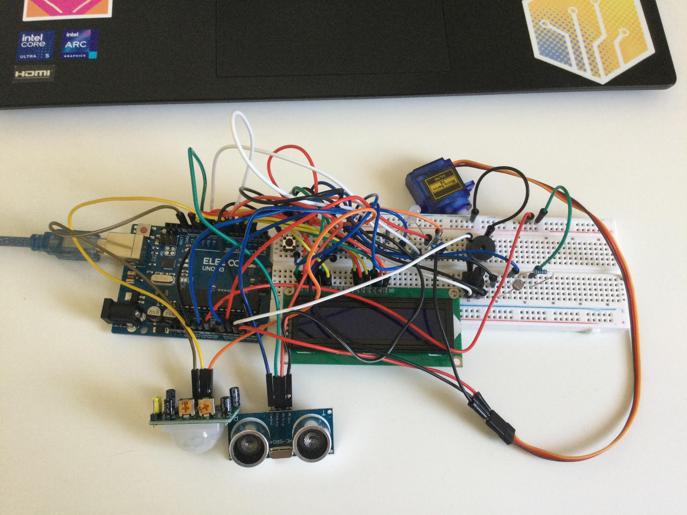

# Kivo

**An AI-powered desk companion that senses you, reads your mood, remembers you, and reacts with light, sound, and motion. It runs entirely on your own machine, with a local LLM and no paid APIs.**



Kivo is built on a single ELEGOO Uno R3. The Arduino is the *hands*: it exposes hardware over a tiny, checksummed serial protocol. A Python "brain" on the host PC holds all of the intelligence: fused sensing, a local language model, mood inference, long-term memory, and expression. The two halves stay cleanly separated, which keeps the whole system testable, swappable, and fully offline.


> **Status: v1.0.** This is a complete, working release of Kivo. It is a personal, long-lived project built to favor clarity, maintainability, and real engineering over shortcuts. Major upgrades are coming soon (see the [Roadmap](#roadmap)).

---

## Table of contents

- [What Kivo does](#what-kivo-does)
- [How it feels to use](#how-it-feels-to-use)
- [Architecture](#architecture)
- [Hardware](#hardware)
- [Getting started](#getting-started)
- [Usage](#usage)
- [Project structure](#project-structure)
- [Testing](#testing)
- [Engineering principles](#engineering-principles)
- [Roadmap](#roadmap)
- [License](#license)

---

## What Kivo does

Kivo pulls together four senses, five expressive outputs, a local AI voice, and a memory into one small companion.

### It senses you
- **Light** (photoresistor): reads the room's brightness.
- **Presence** (PIR + ultrasonic, fused): knows when you are actually at the desk. Sitting perfectly still never fools it, because presence is driven by distance, not just motion.
- **Proximity** (ultrasonic): notices when you lean in close.
- **Emotion** (your PC webcam, optional): reads your facial expression with a local model. Nothing leaves your machine.

### It thinks
- A **local large language model** (via [Ollama](https://ollama.com)) speaks as Kivo. Every line is generated on your machine, for free, and is different every time.
- A **mood engine** fuses time of day, room light, presence, lean-in, and your facial expression into a single mood.
- **Long-term memory** remembers you across sessions: how many times you have visited, the hours you usually show up, and how long it has been since it last saw you.

### It expresses
- **A 16x2 LCD** shows Kivo's voice. Lines too long for the 16 character screen scroll smoothly, so no word is ever cut off.
- **An RGB LED** glows a color for the current mood.
- **A buzzer** plays a short signature chirp on each mood change.
- **A servo** gives Kivo body language: it nods when you arrive, perks up when you lean in, and droops when you leave.

### It responds to touch
- **A push button** gives you three interactions: tap to pet Kivo, double-tap to make it dance, and hold to calm it down.

### It helps you focus
- A passive **break nudge** notices long, unbroken focus sessions and gently suggests a break.
- An optional **pomodoro timer** counts down focus and break intervals on the LCD.

---

## How it feels to use

**Moods map to colors.** The LED and servo change together, driven by time of day, the room, and your face.

| Trigger | Mood | Color | Body language |
|---|---|---|---|
| Nobody there | away | off | droops down to rest |
| Night or dark room | calm | blue | still, centered |
| Evening or dim room | cozy | magenta | relaxed settle |
| Morning | cheerful | yellow | a happy nod |
| Afternoon and bright | focused | white | attentive |
| At the desk (default) | content | green | a small nod |
| You lean in close | excited | cyan | a big bounce |
| You smile at it | happy | yellow | a joyful bounce |
| You look sad | sad | blue | a slow droop |
| You look surprised | surprise | white | a sharp snap up |
| You look angry | angry | red | a sharp jitter |

**The button speaks back.**

| Press | Reaction |
|---|---|
| Tap | pet Kivo: magenta glow, happy chirp, a little bounce |
| Double-tap | a playful cyan dance and a tune |
| Hold (about one second) | shush and dismiss: calm down, center, clear the line |

---

## Architecture

Kivo is split into a hardware half and a software half that talk over one narrow, well-defined seam. The Arduino never makes a decision. The Python brain never touches a pin directly. Everything in between is a small, versioned wire protocol.



### The wire protocol (KSP)

Host and device speak the Kivo Serial Protocol: one ASCII line per message, terminated by a newline, at most 64 bytes. Each frame is `TYPE id body*CRC8`, where the CRC-8 checksum covers everything before the `*`. There are three message types:

- `CMD` (host to device): a command such as `DISPLAY.WRITE` or `SENSOR.SUBSCRIBE`.
- `RES` (device to host): a correlated reply, either `OK` with data or `ERR` with a code.
- `EVT` (device to host): an unsolicited event such as a boot `READY`, a streamed `SENSOR` reading, or a frame-level `ERROR`.

The same framing and CRC are implemented on both sides (Python and C++) and verified against each other, so a corrupt line is detected and dropped rather than misread. See [`protocol/README.md`](protocol/README.md) for the full specification.

### The host brain

The backend layers dependencies downward: `cli` to `device` to `protocol` to `transport`. On top of that sits the `Brain`, a single-threaded loop that owns one long-lived connection, keeps a `WorldState`, and runs a list of pure `Behavior` objects. Each behavior reacts to events and returns `Action` values (show text, set a color, play a tone, move the servo). The brain is the only thing that turns an action into a device command, which means new outputs are added by introducing one action type, not by rewiring every behavior.

Because behaviors are pure and the transport is an interface, the entire stack runs against an in-memory device emulator with no hardware attached. That is how the project keeps 121 automated tests green.

### The firmware

The firmware runs a cooperative loop that never blocks. Bytes arrive on the serial line, are assembled into frames, routed by operation to a handler, and answered. Sensors are serviced on the same loop: the ultrasonic range finder, for example, runs a small non-blocking state machine so a slow echo never stalls command handling. The Arduino-independent framing and CRC live in their own library so they can be unit-tested on the host exactly as they run on the device.

For the deeper design rationale, see [`docs/architecture.md`](docs/architecture.md) and the Architecture Decision Records in [`docs/adr/`](docs/adr).

---

## Hardware

### Bill of materials

Everything here is standard ELEGOO Uno starter-kit hardware.

| Component | Notes |
|---|---|
| ELEGOO Uno R3 | ATmega328P, 32 KB flash, 2 KB SRAM |
| 16x2 LCD (HD44780, parallel) | plus a potentiometer for contrast |
| Photoresistor (LDR) | with a 10k resistor, wired as a voltage divider |
| PIR motion sensor (HC-SR501) | presence |
| Ultrasonic sensor (HC-SR04) | distance and proximity |
| RGB LED (common cathode) | with three 220 ohm resistors |
| Passive buzzer | chirps |
| Micro servo (SG90) | body language |
| Push button | two-way interaction |
| Breadboard and jumper wires | |

A USB webcam or laptop camera is optional, and is only used for facial emotion.

### Pinout

All wiring lives in one place: [`firmware/src/config.h`](firmware/src/config.h).

| Function | Uno pin(s) |
|---|---|
| LCD RS, EN, D4, D5, D6, D7 | 12, 11, 5, 4, 3, 2 |
| Light sensor (LDR) | A0 |
| PIR presence | 7 |
| Ultrasonic TRIG, ECHO | 9, 10 |
| RGB LED R, G, B | 6, 8, A1 |
| Buzzer | A2 |
| Servo | A3 |
| Button | A4 |

Notes: the RGB LED uses digital color (each channel on or off, giving seven primaries) because the Uno's PWM pins are already in use. The ultrasonic ECHO pin connects directly since the Uno is a 5V board. Under load a servo can draw more current than USB comfortably supplies, so if it twitches or resets the board, power the servo from a separate 5V supply that shares ground with the Uno.



---

## Getting started

### 1. Backend (the brain)

The backend ships with an in-memory device emulator, so you can run the full stack and the test suite before wiring anything.

```powershell
cd backend
python -m venv .venv
.venv\Scripts\Activate.ps1        # Windows PowerShell
pip install -e ".[dev]"
pytest                            # run the test suite
kivo --fake identify              # talk to the emulated device
```

### 2. Flash the firmware

Requires [PlatformIO](https://platformio.org). With the Uno connected:

```powershell
pio run -d firmware -e uno -t upload
```

Once flashed, point the CLI at the board's serial port (COM3 on Windows, or `/dev/ttyACM0` on Linux):

```powershell
kivo --port COM3 ping
kivo --port COM3 identify
```

### 3. Local AI (optional but recommended)

Install [Ollama](https://ollama.com) and pull a small, fast model:

```powershell
ollama pull llama3.2:3b
```

A small model reacts in about one to two seconds. Everything runs locally and free.

### 4. Webcam emotion (optional)

Install the vision extra and place two free, open models in `~/.kivo/`:

```powershell
pip install -e ".[vision]"
```

- `emotion-ferplus-8.onnx` (FER+, from the ONNX Model Zoo)
- `face_detection_yunet_2023mar.onnx` (YuNet, from the OpenCV Zoo)

If either model or a camera is missing, Kivo simply prints a note and runs without face-driven mood. Nothing breaks.

### 5. Run Kivo

```powershell
kivo --port COM3 run --ai --model llama3.2:3b --camera --pomodoro
```

---

## Usage

The CLI is the entry point. Global options (`--port`, `--baud`, `--fake`, `-v`) come before the command.

| Command | What it does |
|---|---|
| `ping` | check the device is alive |
| `identify` | print firmware name, version, and protocol |
| `display "text"` | write text to the LCD |
| `clear` | clear the LCD |
| `read <sensor>` | read a sensor once (for example `light`, `distance`) |
| `watch <sensor>` | stream a sensor's values live |
| `calibrate light` | measure your room's real light range so classification is accurate |
| `run` | run Kivo as a live, autonomous companion |

Flags for `run`:

| Flag | Effect |
|---|---|
| `--ai` | let the local model speak as Kivo instead of fixed phrases |
| `--model NAME` | choose the Ollama model (default `llama3`) |
| `--camera` | drive mood from your webcam facial expression |
| `--pomodoro` | show a focus and break timer on the LCD |
| `--forget` | do not use or update long-term memory this session |

Useful environment variables: `KIVO_SERIAL_PORT`, `KIVO_OLLAMA_MODEL`, `KIVO_EMOTION_MIN_PROB` (emotion sensitivity), `KIVO_MEMORY_PATH`, and `KIVO_CALIBRATION_PATH`.

---

## Project structure

```
kivo/
  protocol/            wire-protocol specification (source of truth for both sides)
  firmware/            PlatformIO project for the Uno (C++)
    src/               config.h, kivo.h, kivo.cpp, main.cpp
    lib/kivo_protocol/ Arduino-independent framing and CRC (host-unit-tested)
    test/              native Unity tests for the protocol library
  backend/             Python package `kivo` (the host brain)
    src/kivo/          protocol, transport, device, brain, ai, memory, vision, cli
    tests/             pytest suite (runs against an emulator, no hardware needed)
  docs/                architecture overview and Architecture Decision Records
```

---

## Testing

- **Backend:** 115 tests with `pytest`, all running against the in-memory device emulator. No hardware, no network, and no real model are needed. Run with `pytest` from `backend/`.
- **Firmware:** 6 native tests with Unity, covering the framing and CRC. Run with `pio test -d firmware -e native`.

Firmware footprint on the Uno is about 41 percent of RAM and 44 percent of flash, leaving plenty of headroom.

---

## Engineering principles

Kivo is built to be read as much as run.

- **Hands and brain are separate.** The Uno exposes capabilities. The host owns all logic. Neither reaches across the seam.
- **A real protocol, not ad-hoc serial.** Framed, checksummed, versioned, and mirrored on both sides.
- **Nothing hardcoded without reason.** Pins, timings, protocol tokens, and geometry live in one place each.
- **Pure behaviors, single-threaded brain.** Easy to reason about and easy to test.
- **Everything is testable offline.** An in-memory emulator stands in for the hardware.
- **Free and local by rule.** The AI is a local model. No paid APIs, and nothing leaves your machine.

---

## Roadmap

v1.0 is a complete, working companion. Major upgrades are coming soon, including a custom enclosure, richer AI personality and conversation, more senses, and a proper always-on host service. Watch this space.

---

## License

Released under the MIT License. See [`LICENSE`](LICENSE).

Built by Vedh Sonawane.
